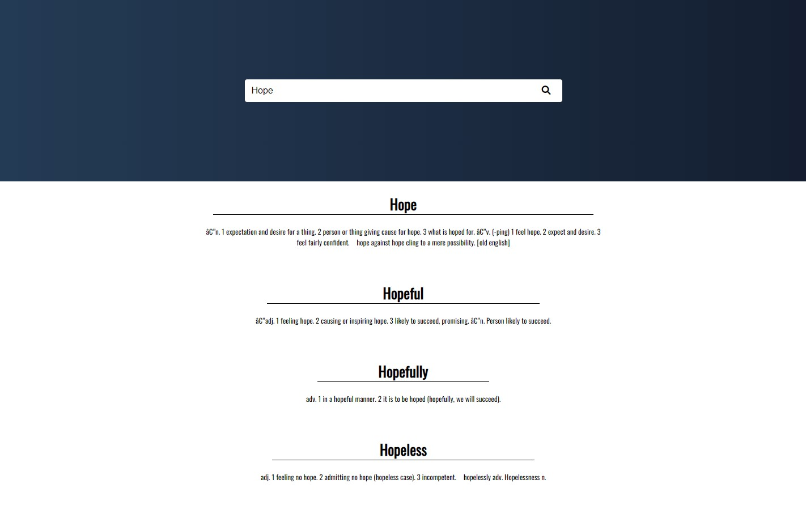
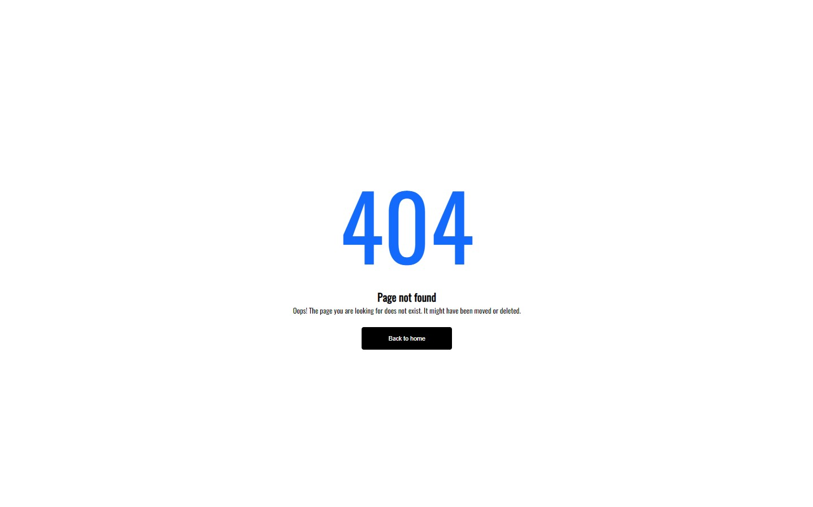

# PHP - English Dictionary app

This is a simple dictionary application written in php.

# Schreenshots

# How it works?

The user searches for a word, and the application finds that word in the database and returns that word and the value of that word.

# Usage

- Create database (e.g) dict and import SQL file there (./src/sql/oedict.sql)

# Built with

- Semantic HTML5 markup
- CSS custom properties
- Php
- JavaScript

# Useful resources

- [Flaticon](https://www.flaticon.com/)

# Author

- [Artur Harutyunyan](https://github.com/ArturHarutyunyan1)