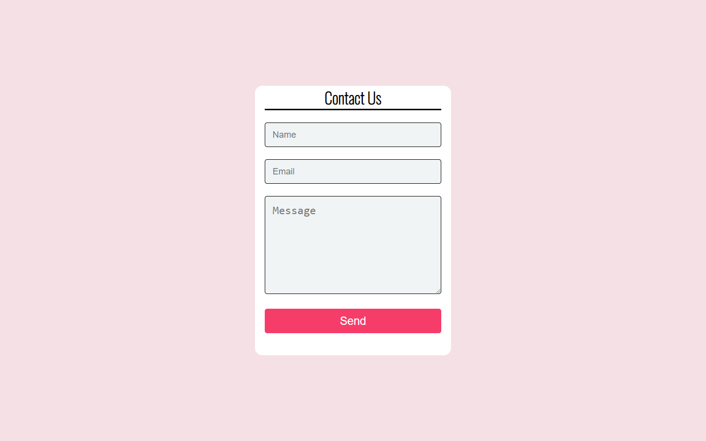

# Php working contact form

This is a simple working php contact form that can send messages to a recipient's email address from a user on your site.

#Usage

- Set up your XAMPP server to send emails
- Create database (e.g) contact-form, and import messages.sql file there (src/sql/messages.sql)
- Edit Mysql connect line (index.php line 10)
- Set receiver email address (index.php line 30)

# Built with

- Semantic HTML5 markup
- CSS custom properties
- PHP
- JavaScript

# Author

[ArturHarutyunyan](https://github.com/ArturHarutyunyan1)